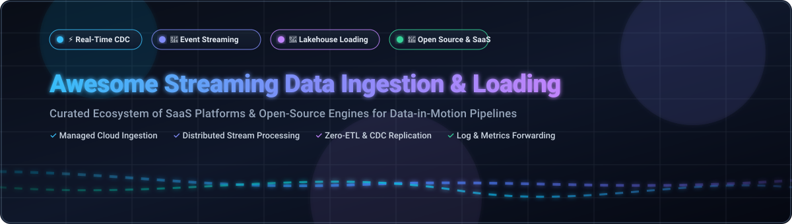
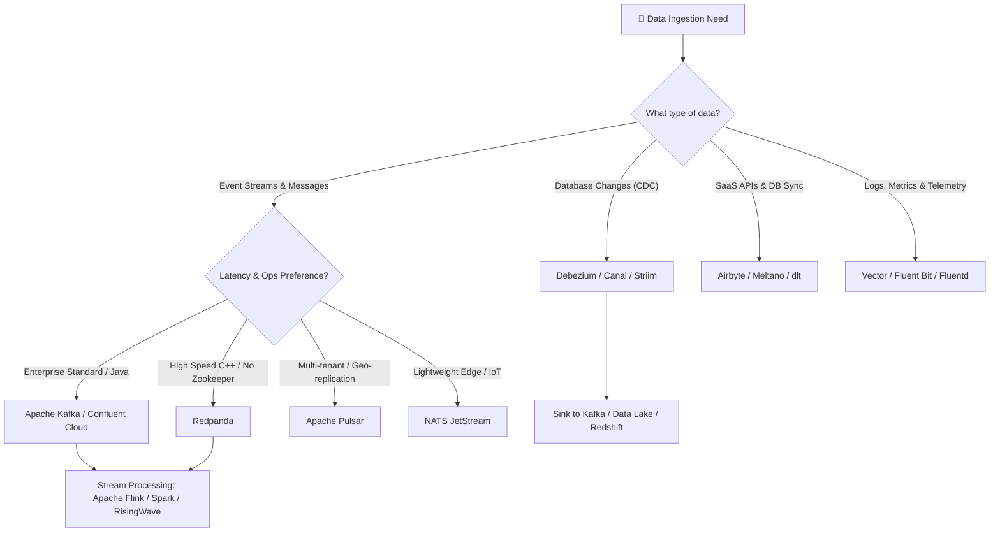

# ⚡ Awesome Streaming Data Ingestion & Loading

  
  
  
  

  

---

### 🌊 Curated Guide to Streaming Data Ingestion, Real-Time Event Streaming & Self-Hosted Data Loading Systems

Welcome to the definitive, SEO-optimized repository tracking notable **commercial streaming ingestion platforms**, **managed cloud services**, and **open-source GitHub projects**. These technologies capture, buffer, transform, and load data in motion — from event streams, database CDC logs, IoT sensors, and APIs into data lakes, lakehouses, warehouses, and analytical stores with sub-second latency.

---

## 📑 Table of Contents
- [🏢 SaaS & Managed Cloud Platforms](#-saas--managed-cloud-platforms)
- [🚀 Open-Source GitHub Projects](#-open-source-github-projects)
- [🎯 Framework Selection Guide](#-framework-selection-guide)
- [🤝 How to Contribute](#-how-to-contribute)
- [📜 Disclaimer](#-disclaimer)
- [💖 Support & Sponsorship](#-support--sponsorship)
- [📈 Star History](#-star-history)

---

## 🏢 SaaS & Managed Cloud Platforms

📊 **Market Size & Industry Structure**: The global **Streaming Data Ingestion & Real-Time Analytics Market** is estimated at **$18.5 Billion** and is projected to reach **$42.8 Billion by 2030** (CAGR ~21.5%). The market is **moderately fragmented**—anchored by cloud hyperscalers (Azure, AWS, Google Cloud) and enterprise streaming infrastructure leaders (Databricks, Confluent), while coexisting with fast-growing specialized real-time CDC and ELT platforms (Airbyte, Redpanda, Striim, Hevo).

Below is the curated list of enterprise SaaS & managed streaming ingestion platforms, sorted by **Company Size / Revenue / Valuation (Descending)**:

| Platform / Product 🏢 | Description & Capabilities 📝 | Starting Price 💰 | Free Tier / Trial Limits 🎁 | Company Size / Valuation 📊 |
| :--- | :--- | :--- | :--- | :--- |
| **[Microsoft Azure Event Hubs](https://azure.microsoft.com/en-us/products/event-hubs/)** | Azure's big data streaming platform & event ingestion service. Event Hubs Capture automatically streams data to Blob Storage and Azure Data Lake. | `$0.015/hour per Throughput Unit (~$11/month) or $0.028/GB for Event Hubs Capture` | `1,000,000 free ingress events + 30-Day $200 free credit trial` | **Microsoft Azure ($110B+ Cloud Rev)** |
| **[AWS Kinesis Data Firehose](https://aws.amazon.com/kinesis/data-firehose/)** | AWS fully managed streaming delivery service — automatically loads data into S3, Redshift, OpenSearch, and Splunk with inline Lambda transformations. | `$0.029 per GB ingested (first 500 TB/mo) + $0.0000002 per transformation request` | `AWS Free Tier: 25 GB/month free ingestion for 12 months` | **AWS ($100B+ Cloud Rev)** |
| **[Databricks Auto Loader](https://www.databricks.com/)** | Incremental streaming ingestion for lakehouses — automatically detects and loads millions of files per hour from cloud storage into Delta Lake with schema evolution. | `$0.07 to $0.40 per DBU (Databricks Unit) depending on compute tier (~$0.15/DBU avg)` | `14-day full-featured free trial with $300 cloud credits` | **Databricks ($43B Valuation)** |
| **[Google Cloud Dataflow](https://cloud.google.com/dataflow)** | Google Cloud fully managed serverless stream and batch data processing powered by Apache Beam with auto-scaling and sub-second latency. | `$0.056/hour per vCPU + $0.0069/hour per GB memory (~$0.07/unit-hour)` | `90-day free trial with $300 free credits across Google Cloud` | **Google Cloud ($40B+ Cloud Rev)** |
| **[Confluent Cloud](https://www.confluent.io/confluent-cloud/)** | The enterprise standard managed Apache Kafka platform — fully managed Kafka, ksqlDB, Flink, 120+ cloud connectors, and governance schema registry. | `$0.10/hour per cluster unit + $0.11/GB egress / $0.05/GB ingress (Basic cluster from $0.00/hr base + usage)` | `$400 free credits valid for 30 days upon sign-up` | **Confluent ($8B Valuation / $1B ARR)** |
| **[Airbyte Cloud](https://airbyte.com/)** | Managed version of the leading open-source ELT platform — 300+ pre-built connectors for streaming data replication into warehouses and vector databases. | `$0.10 per Credit (~$10/GB or 6k rows per credit for database/warehouse targets)` | `14-day free trial with 6,000 free credits (no credit card required)` | **Airbyte ($1.5B Valuation)** |
| **[Redpanda Cloud](https://redpanda.com/)** | Kafka-compatible high-performance streaming platform built in C++ — zero Zookeeper, zero JVM, 10x faster latency with serverless stream loading. | `$0.14 per Serverless Unit-hour or ~$0.08/GB data transfer` | `14-day free trial with $300 serverless & dedicated credits` | **Redpanda ($200M+ Valuation / $115M Raised)** |
| **[Striim](https://www.striim.com/)** | Enterprise real-time data integration & CDC streaming analytics platform for zero-downtime cloud migration and continuous database replication. | `$1,500/month starting base license for enterprise streaming CDC pipelines` | `30-day free trial with up to 10 Million events stream limit` | **Striim ($100M+ Valuation / $100M+ Raised)** |
| **[Hevo Data](https://hevodata.com/)** | No-code automated data pipeline platform — 150+ connectors with automated schema mapping and near real-time streaming data ingestion. | `$239/month for Starter Plan (up to 5 Million Events/month)` | `Free Forever Plan (1 Million Events/month) + 14-day free trial for premium tiers` | **Hevo Data ($100M+ Valuation / $40M Raised)** |

---

## 🚀 Open-Source GitHub Projects

Streaming data ingestion is one of the strongest open-source software ecosystems. Below is a comprehensive, curated matrix of top open-source projects across **Event Streaming**, **Stream Processing**, **ELT & Data Loading**, **CDC (Change Data Capture)**, **Log Observability**, and **Data Lakehouse Storage**.

> 💡 **Note**: Every Stars_Badge links directly to the repo's official **Stargazers Page**. The list is sorted strictly by **GitHub Stars_Count (Descending)**.

| Project Name 🚀 | GitHub_Stars ⭐ | Category 🏷️ | Description & Key Features 📝 | License 📜 |
| :--- | :---: | :--- | :--- | :---: |
| **[ClickHouse](https://github.com/ClickHouse/ClickHouse)** |  | `Real-Time Analytical Storage` | Columnar real-time DBMS for ultra-fast streaming ingestion & analytics. | `Apache-2.0` |
| **[Apache Airflow](https://github.com/apache/airflow)** |  | `Orchestration & Workflow` | Programmatically author, schedule, and orchestrate complex data ingestion pipelines. | `Apache-2.0` |
| **[Apache Spark Structured Streaming](https://github.com/apache/spark)** |  | `Stream Processing` | Unified batch and stream processing engine with micro-batch & continuous streaming. | `Apache-2.0` |
| **[Apache Kafka](https://github.com/apache/kafka)** |  | `Event Streaming Platforms` | The distributed event streaming platform for high-throughput data pipelines & Kafka Streams. | `Apache-2.0` |
| **[Canal](https://github.com/alibaba/canal)** |  | `Change Data Capture (CDC)` | MySQL binlog incremental subscription and Change Data Capture (CDC) component. | `Apache-2.0` |
| **[Apache Flink](https://github.com/apache/flink)** |  | `Stream Processing` | Stateful stream processing framework with low-latency event-time processing. | `Apache-2.0` |
| **[Vector](https://github.com/vectordotdev/vector)** |  | `Observability & Log Streaming` | High-performance observability data pipeline in Rust for logs, metrics, and events. | `MPL-2.0` |
| **[Airbyte](https://github.com/airbytehq/airbyte)** |  | `Data Ingestion & ELT` | Open-source ELT data integration engine with 300+ pre-built connectors. | `ELv2/MIT` |
| **[NATS](https://github.com/nats-io/nats-server)** |  | `Event Streaming Platforms` | Cloud-native, lightweight pub/sub messaging system with JetStream persistence. | `Apache-2.0` |
| **[Apache Pulsar](https://github.com/apache/pulsar)** |  | `Event Streaming Platforms` | Multi-tenant, geo-replicated distributed messaging & streaming storage system. | `Apache-2.0` |
| **[dbt Core](https://github.com/dbt-labs/dbt-core)** |  | `Transformation & Analytics` | Transform data in motion and at rest inside data warehouses with SQL. | `Apache-2.0` |
| **[Fluentd](https://github.com/fluent/fluentd)** |  | `Observability & Log Streaming` | Unified logging layer for log collection, parsing, and streaming ingestion. | `Apache-2.0` |
| **[Debezium](https://github.com/debezium/debezium)** |  | `Change Data Capture (CDC)` | Leading open-source CDC platform capturing row-level changes from databases into Kafka. | `Apache-2.0` |
| **[Redpanda](https://github.com/redpanda-data/redpanda)** |  | `Event Streaming Platforms` | Kafka-compatible event streaming platform written in C++ with zero JVM/Zookeeper. | `BSL` |
| **[Apache SeaTunnel](https://github.com/apache/seatunnel)** |  | `Data Ingestion & ELT` | High-performance distributed data integration engine supporting batch and stream sync. | `Apache-2.0` |
| **[RisingWave](https://github.com/risingwavelabs/risingwave)** |  | `Stream Processing` | Distributed SQL database for real-time stream processing and continuous materialization. | `Apache-2.0` |
| **[Apache Iceberg](https://github.com/apache/iceberg)** |  | `Streaming Data Lake Storage` | High-performance open table format for huge analytic datasets supporting streaming ingestion. | `Apache-2.0` |
| **[Delta Lake](https://github.com/delta-io/delta)** |  | `Streaming Data Lake Storage` | Open-source storage layer that brings ACID transactions and streaming reads/writes to data lakes. | `Apache-2.0` |
| **[Redpanda Connect (Benthos)](https://github.com/redpanda-data/connect)** |  | `Stream Processing / Ingestion` | Declarative stream processor for data pipeline integration without writing code. | `Apache-2.0` |
| **[Apache Beam](https://github.com/apache/beam)** |  | `Stream Processing` | Unified programming model for portable batch and streaming data processing pipelines. | `Apache-2.0` |
| **[Fluent Bit](https://github.com/fluent/fluent-bit)** |  | `Observability & Log Streaming` | Fast, ultra-lightweight log and metrics processor and forwarder for Kubernetes & Edge. | `Apache-2.0` |
| **[Apache Hudi](https://github.com/apache/hudi)** |  | `Streaming Data Lake Storage` | Streaming data lakehouse platform bringing transactions, CDC, and incremental ingestion to data lakes. | `Apache-2.0` |
| **[Apache NiFi](https://github.com/apache/nifi)** |  | `Data Ingestion & Flow Automation` | Visual dataflow automation platform for real-time routing, transformation, and enterprise ingestion. | `Apache-2.0` |
| **[dlt (data loading tool)](https://github.com/dlt-hub/dlt)** |  | `Data Ingestion & ELT` | Python library for declarative loading of data from APIs and streams into databases. | `Apache-2.0` |
| **[Maxwell](https://github.com/zendesk/maxwell)** |  | `Change Data Capture (CDC)` | Lightweight MySQL Change Data Capture (CDC) daemon reading binlogs to Kafka/Kinesis. | `Apache-2.0` |
| **[Meltano](https://github.com/meltano/meltano)** |  | `Data Ingestion & ELT` | CLI-first open-source ELT platform leveraging Singer taps and targets. | `MIT` |
| **[Embulk](https://github.com/embulk/embulk)** |  | `Data Ingestion & ELT` | Pluggable bulk data loader for parallel data transfers between databases and stores. | `Apache-2.0` |
| **[ksqlDB](https://github.com/confluentinc/ksql)** |  | `Stream Processing` | Event streaming database for building stream processing applications on Kafka with SQL. | `Confluent Community` |

---

## 🎯 Framework Selection Guide

---

## 🤝 How to Contribute

1. 🍴 **Fork the Repository** on GitHub.
2. ✏️ **Add/Edit Entries** in `README.md` matching the existing table schemas.
3. 📋 **Include required metadata**: Name, official link, factual 1-2 sentence description, open-source license or pricing structure.
4. 🚀 **Submit a Pull Request** with a descriptive summary of changes.

---

## 📜 Disclaimer

- 📌 **Community Curated**: This repository is maintained for educational and architectural reference purposes.
- 🔒 **Security & Compliance**: Streaming ingestion engines process sensitive enterprise data in motion. Self-hosted deployments require proper encryption, access control, and schema validation.
- ⚖️ **Licensing Note**: Verify individual project licenses (e.g., Apache-2.0, BSL, ELv2, MPL-2.0) before deploying in production environments.

---

## 💖 Support & Sponsorship

If you find this curated ecosystem list helpful for your data engineering work or system architecture design:

- ⭐ **Star this repository** to help others discover it!
- 🔀 **Fork & Share** with your team and technical network.
- ☕ **Support ongoing open-source maintenance**: Consider sponsoring via the [GitHub Sponsor Dashboard](https://github.com/sponsors/ishandutta2007).

  

---

## 📈 Star History

---

  <i>Maintained with ❤️ by <a href="https://github.com/ishandutta2007">Ishan Dutta</a> for data engineers, platform architects, and real-time streaming enthusiasts worldwide.</i>

